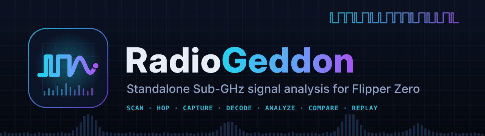
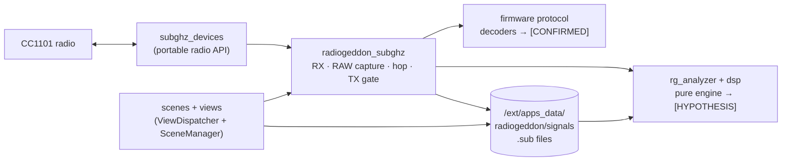

<div align="center">



# RadioGeddon

**A standalone Sub-GHz radio analysis toolkit for the Flipper Zero.**
Scan, hop, capture, identify, analyse, compare and (where authorized) replay
Sub-GHz signals — entirely on the device, with no computer, phone or network.

[](https://github.com/mrSlime-man/RADIOGEDDON/actions/workflows/ci.yml)
[](https://github.com/mrSlime-man/RADIOGEDDON/releases)
[](LICENSE)
[-a855f7.svg)](https://flipperzero.one)
[](docs/FIRMWARE_COMPATIBILITY.md)
[](docs/VERIFICATION.md)

[Download](#-download) · [Install](docs/INSTALLATION.md) · [User Guide](docs/USER_GUIDE.md) · [Features](docs/FEATURES.md) · [Docs](docs/)

</div>

---

> [!WARNING]
> **Public beta.** Every feature is implemented and the builds pass all
> automated checks (lint, 264 host-test checks, three firmware builds with
> API/manifest verification). On physical hardware, so far there is only one
> tester report (RogueMaster: launches and works); **nothing is independently
> verified on a device yet.** Expect rough edges, and see
> [VERIFICATION.md](docs/VERIFICATION.md) for exactly what has and hasn't been
> tested. Testing on real hardware is the single most useful thing you can
> contribute — the [hardware checklist](docs/HARDWARE_CHECKLIST.md) shows how.

## What is it?

RadioGeddon turns a Flipper Zero into a self-contained Sub-GHz workbench. It
reuses the firmware's own radio drivers and protocol decoders — so
identification matches the stock Sub-GHz app — and adds a layer of analysis on
top: per-frequency signal-strength scanning, a frequency hopper, RAW capture,
pulse-timing and line-encoding analysis for unknown protocols, constant-vs-
changing field maps across repeated presses, side-by-side comparison, a
static-vs-rolling classifier, an on-SD-card signal database, and authorized
replay. Everything runs on the device; recordings are plain `.sub` files.

It is an **analysis and authorized-testing** tool. RadioGeddon itself does
**not** recover keys, decrypt payloads, or predict rolling codes, and it refuses
to replay decoded rolling-code protocols — those are deliberate non-goals. (It
does display the firmware's own decoder output, which may use the SD-card
keystore to identify KeeLoq-family signals.)

## ⬇ Download

Grab the build that matches your firmware from the
[**v1.0.0-beta.2 release**](https://github.com/mrSlime-man/RADIOGEDDON/releases/tag/v1.0.0-beta.2),
then copy it to `apps/Sub-GHz/` on the SD card (full steps in
[Installation](docs/INSTALLATION.md)).

| Your firmware | Download this file |
|---------------|--------------------|
| **Official** (flipperzero.one) | [`radiogeddon-official.fap`](https://github.com/mrSlime-man/RADIOGEDDON/releases/tag/v1.0.0-beta.2) |
| **Unleashed** | [`radiogeddon-unleashed.fap`](https://github.com/mrSlime-man/RADIOGEDDON/releases/tag/v1.0.0-beta.2) |
| **RogueMaster** | [`radiogeddon-roguemaster.fap`](https://github.com/mrSlime-man/RADIOGEDDON/releases/tag/v1.0.0-beta.2) |

Each firmware family has its own SDK API version, so **install the file for
your firmware** — the wrong one is safely refused with an "Outdated App /
Firmware" message rather than loading. Not sure which you have, or using another
fork? See [Firmware Compatibility](docs/FIRMWARE_COMPATIBILITY.md). Every
release lists `SHA256SUMS` and ships signed build-provenance attestations.

## Features

| Module | What it does |
|--------|--------------|
| **Sub-GHz Scanner** | Narrowband RSSI sweep over a configurable list of 19 common frequencies: noise floor, activity detection, peak hold, burst counts, CSV export; pick one to receive on. |
| **Frequency Hopper** | Hops a configurable list (default 315 / 390 / 433.92 / 868.35 MHz), holds on noise-floor-relative activity or decodes, lock/next, statistics, optional auto RAW recording. |
| **RAW Signal Capture** | Records the raw on/off timing stream to a standard RAW `.sub` file. |
| **Protocol Identification** | Live decoding with the firmware's own decoders (Princeton, CAME, Nice FLO, Holtek, KeeLoq-family, …) — marked `[CONFIRMED]`. |
| **Signal Analyzer** | Pulse-width groups and base time unit for RAW; bit/field breakdown for decoded protocols. |
| **Unknown Protocol Analysis** | Streams a whole RAW capture: measured timing, noise and frames (`[OBSERVED]`), then the encoding (PWM/PPM/Manchester) with a confidence score, bit patterns, frame-by-frame comparison and field map (`[HYPOTHESIS]`). |
| **Pulse Timeline** | Zoomable, scrollable waveform of a RAW capture with frame markers and pulse durations, streamed from the SD card. |
| **Signal Comparison** | Field-by-field diff of two recordings; for RAW captures, a timing-similarity score and a frame-pattern comparison that does not depend on when recording started. |
| **Device ID Candidate Detection** | Offers the longest run of bits that stay constant while others change as a candidate device identifier. |
| **Rolling Code Classification** | Flags static vs. dynamic (rolling-code) protocols, and highlights changing bits in unknown ones. |
| **Cryptographic Structure Heuristics** | Key-byte variety and key-delta hints — never key recovery. |
| **Signal Database** | Browse, analyse, compare, replay and delete recordings stored as `.sub` on the SD card. |
| **Authorized Signal Replay** | Transmits RAW and static-protocol captures where the firmware's region rules allow; refuses decoded rolling-code protocols and unrecognised modulations. A RAW capture is sent exactly as recorded. |

Analysis conclusions are labelled **`[CONFIRMED]`** (a firmware decoder
matched), **`[OBSERVED]`** (measured from the timing), **`[HEURISTIC]`** (a
statistics-based guess) or **`[HYPOTHESIS]`** (an engine inference) — a guess is never dressed up as a decode (plain summary and
field lines carry no label). Full details, including
verification state per feature, are in [Features](docs/FEATURES.md) and
[Protocol Analysis](docs/PROTOCOL_ANALYSIS.md).

## Install

1. Download the `.fap` for your firmware (above).
2. Copy it to `SD Card/apps/Sub-GHz/` with qFlipper or a card reader.
3. On the Flipper: **Apps → Sub-GHz → RadioGeddon**.

Step-by-step instructions, download verification and troubleshooting:
[Installation](docs/INSTALLATION.md) · [Troubleshooting](docs/TROUBLESHOOTING.md).

## Usage

Physical buttons only: **Up/Down** move, **OK** selects, **Left/Right** change
settings (and **Left** toggles RAW recording while receiving), **Back** returns.

A typical session: open the **Scanner** to find a device's frequency → press
**OK** to receive there → watch it decode, or press **Left** to RAW-record →
**OK**/save → open it from the **Database** to analyse, compare, or (where you
are authorized) replay. The full walkthrough of every screen is in the
[User Guide](docs/USER_GUIDE.md).

## Architecture



The radio layer uses only the portable `subghz_devices` API — the same one the
stock app uses — so a single source tree builds for all three firmware
families. The analysis engine (`helpers/rg_analyzer.*`, `helpers/radiogeddon_dsp.*`)
has no firmware dependencies, so it is unit-tested on a normal computer. Deeper
dive: [Architecture](docs/ARCHITECTURE.md).

## Building from source

```bash
git clone https://github.com/mrSlime-man/RADIOGEDDON.git
cd RADIOGEDDON
source scripts/firmware_pins.sh && pip install "ufbt==${UFBT_VERSION}"

scripts/build_target.sh official      # -> dist/release/radiogeddon-official.fap (+ verified)
scripts/build_target.sh unleashed
scripts/build_target.sh roguemaster   # clones RogueMaster at a pinned commit (large)
scripts/build_release.sh              # all three + SHA256SUMS + BUILD_INFO.txt
```

Each build downloads the exact SDK pinned in
[`scripts/firmware_pins.sh`](scripts/firmware_pins.sh), verifies its SHA-256 and
API version, compiles, and checks the resulting `.fap`'s manifest. More in
[Contributing](CONTRIBUTING.md#development-setup).

## Testing & verification

```bash
make -C test check               # 264 host checks, -Werror, AddressSanitizer + UBSan
python3 scripts/check_links.py   # documentation links and anchors
```

CI runs the link check, the host tests, and all three firmware builds (with API
and manifest verification plus lint) on every pull request and release tag.
**CI cannot exercise the radio**, so on-device behaviour remains unverified —
tracked honestly in [VERIFICATION.md](docs/VERIFICATION.md) with the test plan
in [HARDWARE_CHECKLIST.md](docs/HARDWARE_CHECKLIST.md).

## Roadmap

Development runs through numbered milestones (scanner, hopper, analyzer,
streaming recording, database, interface, external radio, reliability), with
hardware verification as the gate to a stable `1.0.0`. See the
[Roadmap](docs/ROADMAP.md).

## Contributing

Contributions are welcome — especially **hardware test reports**. See
[CONTRIBUTING.md](CONTRIBUTING.md), pick up an
[issue](https://github.com/mrSlime-man/RADIOGEDDON/issues), and note the
[Code of Conduct](CODE_OF_CONDUCT.md). Found a security problem? Report it
privately per the [Security Policy](SECURITY.md).

## License & responsible use

RadioGeddon is released under the [MIT License](LICENSE).

It is intended for education, research, and testing of devices you own or are
explicitly authorized to test. Receiving and especially transmitting radio
signals is regulated and the rules vary by country; the firmware's regional
restrictions stay in force, but **you** are responsible for complying with the
law where you are. RadioGeddon itself does not break encryption, recover keys,
or defeat rolling codes.

<div align="center">
<sub>Built for the Flipper Zero community. Not affiliated with Flipper Devices Inc.</sub>
</div>
