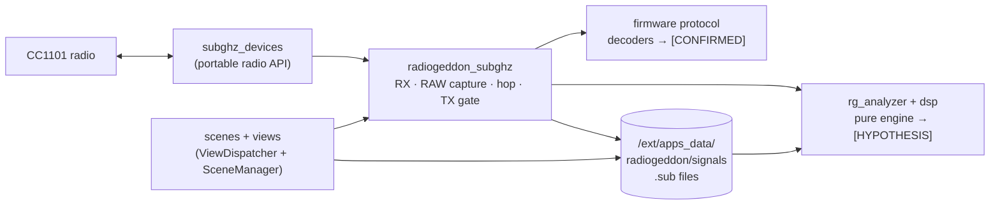

<div align="center">


# RadioGeddon

**A standalone Sub-GHz radio analysis toolkit for the Flipper Zero.**
Scan, hop, capture, identify, analyse, compare and (where authorized) replay
Sub-GHz signals — entirely on the device, with no computer, phone or network.

[](https://github.com/mrSlime-man/RADIOGEDDON/actions/workflows/ci.yml)
[](https://github.com/mrSlime-man/RADIOGEDDON/releases)
[](LICENSE)
[-a855f7.svg)](https://flipperzero.one)
[](docs/FIRMWARE_COMPATIBILITY.md)
[](docs/VERIFICATION.md)

[Download](#-download) · [Install](docs/INSTALLATION.md) · [User Guide](docs/USER_GUIDE.md) · [Features](docs/FEATURES.md) · [Docs](docs/)

</div>

---

> [!WARNING]
> **Public beta.** Every feature is implemented and the builds pass all
> automated checks (lint, 1,962 host-test checks, format, decoder, capture,
> engine-lifecycle and offline UI tests, fuzzing, static analysis of both
> editions, four firmware builds with API, manifest, imported-symbol and
> module verification). On physical hardware there is only one tester report
> so far, for the beta 2 code (RogueMaster: launches and works); **nothing in
> betas 3 to 7 is verified on a device yet** — including the Waterfall,
> Bitstream Explorer, Multi-Capture Compare, Sessions and the on-demand
> modules that beta 7 adds. Expect rough edges, and see
> [VERIFICATION.md](docs/VERIFICATION.md) for exactly what has and hasn't been
> tested. Testing on real hardware is the single most useful thing you can
> contribute — the [hardware checklist](docs/HARDWARE_CHECKLIST.md) shows how.

## What is it?

RadioGeddon turns a Flipper Zero into a self-contained Sub-GHz workbench. It
reuses the firmware's own radio drivers and protocol decoders — so
identification matches the stock Sub-GHz app — and adds a layer of analysis on
top: per-frequency signal-strength scanning, a frequency hopper, RAW capture,
pulse-timing and line-encoding analysis for unknown protocols, constant-vs-
changing field maps across repeated presses, side-by-side comparison, a
static-vs-rolling classifier, an on-SD-card signal database, and authorized
replay. Everything runs on the device; recordings are plain `.sub` files.

It is an **analysis and authorized-testing** tool. RadioGeddon itself does
**not** recover keys, decrypt payloads, or predict rolling codes, and it refuses
to replay decoded rolling-code protocols — those are deliberate non-goals. (It
does display the firmware's own decoder output, which may use the SD-card
keystore to identify KeeLoq-family signals.)

## Two editions

RadioGeddon comes in two editions built from one source tree
([`radiogeddon_edition.h`](radiogeddon_edition.h)):

- **RadioGeddon Full** — the flagship research edition for **RogueMaster**,
  **Momentum** and **Unleashed**. Everything below, plus range scanning across
  every band the radio tunes, an RSSI sweep-history **Waterfall**, the
  **Bitstream Explorer**, **Multi-Capture Compare**, research **Sessions**,
  scan profiles, favorite frequencies, fine frequency stepping and
  checksum-structure hypotheses. Its optional tools load from the SD card
  only while their screen is open. Transmitting follows the installed
  firmware's own rules.
- **RadioGeddon Catalog** — the **Official firmware** edition, prepared for the
  Flipper Apps Catalog. The full receive and analysis toolkit; before any
  transmission it asks the firmware for its region and refuses (and says why)
  unless that region allows the frequency.

| | Catalog | Full |
|---|:---:|:---:|
| Target firmware | Official | RogueMaster, Momentum, Unleashed |
| Scanner (19-frequency list), Frequency Hopper | ✓ | ✓ |
| Receive & decode, streaming RAW recording | ✓ | ✓ |
| Decode with Firmware, Signal Analyzer, Unknown Protocol Analysis | ✓ | ✓ |
| Pulse Timeline, comparison, Signal Database | ✓ | ✓ |
| External CC1101, memory diagnostics | ✓ | ✓ |
| Replay | region-checked by the app **and** the firmware | the firmware's own rules |
| **Range Scanner** (start/end/step, 256 points, crosses band gaps) | — | ✓ |
| **Scan profiles** (save / load / delete) | — | ✓ |
| **Favorites** (Receive, Scanner and Hopper sources) | — | ✓ |
| **Fine frequency stepping** (1 kHz – 1 MHz across gaps), **Radio bands** screen | — | ✓ |
| **Checksum / CRC structure hypotheses** | — | ✓ |
| **Waterfall** (RSSI sweep history of the range) | — | ✓ |
| **Bitstream Explorer** (frames, bits, hex, diff, fields) | — | ✓ |
| **Multi-Capture Compare** (up to 8 recordings) | — | ✓ |
| **Research Sessions** (groups of recordings, grouping suggestions) | — | ✓ |
| App name / appid | RadioGeddon / `radiogeddon` | RadioGeddon Full / `radiogeddon_full` |

Both editions keep their data in `/ext/apps_data/radiogeddon`, so recordings,
settings, favorites and profiles carry over when you switch — see
[Features → Editions](docs/FEATURES.md#editions).

## ⬇ Download

Grab the build that matches your firmware from the
[**v1.0.0-beta.7 release**](https://github.com/mrSlime-man/RADIOGEDDON/releases/tag/v1.0.0-beta.7),
then copy it to `apps/Sub-GHz/` on the SD card (full steps in
[Installation](docs/INSTALLATION.md)).

| Your firmware | Edition | Download this file |
|---------------|---------|--------------------|
| **Official** (flipperzero.one) | Catalog | [`radiogeddon-catalog-official.fap`](https://github.com/mrSlime-man/RADIOGEDDON/releases/download/v1.0.0-beta.7/radiogeddon-catalog-official.fap) |
| **RogueMaster** | Full | [`radiogeddon-full-roguemaster.fap`](https://github.com/mrSlime-man/RADIOGEDDON/releases/download/v1.0.0-beta.7/radiogeddon-full-roguemaster.fap) |
| **Momentum** | Full | [`radiogeddon-full-momentum.fap`](https://github.com/mrSlime-man/RADIOGEDDON/releases/download/v1.0.0-beta.7/radiogeddon-full-momentum.fap) |
| **Unleashed** | Full | [`radiogeddon-full-unleashed.fap`](https://github.com/mrSlime-man/RADIOGEDDON/releases/download/v1.0.0-beta.7/radiogeddon-full-unleashed.fap) |

Each firmware family has its own SDK and symbol table, so **install the file
for your firmware** — the wrong one is refused ("Outdated App / Firmware" or
a missing-symbol error) rather than loading. Every file is compiled against
that firmware's own pinned SDK; none is a renamed copy of another. Not sure
which you have? See [Firmware Compatibility](docs/FIRMWARE_COMPATIBILITY.md).
Every release lists `SHA256SUMS` and ships signed build-provenance
attestations. The Catalog edition is being prepared for the official Apps
Catalog; it is **not** in the catalog yet.

## Features

| Module | What it does |
|--------|--------------|
| **Sub-GHz Scanner** | Narrowband RSSI sweep over a configurable list of 19 common frequencies (Full: or your favorites): noise floor, activity detection, peak hold, burst counts, CSV export; OK receives there, long OK receives and starts recording. |
| **Range Scanner** *(Full)* | Start / end / step sweep of up to 256 points across every band the radio accepts, skipping the gaps; dwell, threshold, pause on hit, noise-floor recalibration, peak hold, counters, sweep-time estimate, CSV export and saved profiles. |
| **Waterfall** *(Full)* | The Range Scanner's sweeps as an **RSSI sweep history**: frequency across, one row per complete sweep, newest on top, signal strength as dither density over each column's noise floor, strong signals solid, unmeasured cells marked. Pause, scroll back, sensitivity, peak, Receive on the cursor and CSV export. Sequential narrowband sweeps — not a wideband or SDR capture. |
| **Favorites** *(Full)* | Up to 24 favorite frequencies; receive or record on one, or scan / hop the whole list. |
| **Frequency Hopper** | Hops a configurable list (default 315 / 390 / 433.92 / 868.35 MHz), holds on noise-floor-relative activity or decodes, lock/next, statistics, optional auto RAW recording. |
| **RAW Signal Capture** | Streams the raw on/off timing to a standard RAW `.sub` file on the SD card while recording, so length is limited by the card, not RAM; shows time, samples and any samples lost to a slow card. |
| **Protocol Identification** | Live decoding with the firmware's own decoders (Princeton, CAME, Nice FLO, Holtek, KeeLoq-family, …) — marked `[CONFIRMED]`. |
| **Signal Analyzer** | Pulse-width groups and base time unit for RAW; bit/field breakdown for decoded protocols. |
| **Unknown Protocol Analysis** | Streams a whole RAW capture: measured timing, noise and frames (`[OBSERVED]`), then the encoding (PWM/PPM/Manchester) with a confidence score, bit patterns, frame-by-frame comparison and field map (`[HYPOTHESIS]`). Full: also tests whether the frames end in a common checksum (XOR, sum, CRC-8, parity). |
| **Pulse Timeline** | Zoomable, scrollable waveform of a RAW capture with frame markers and pulse durations, streamed from the SD card. |
| **Bitstream Explorer** *(Full)* | The bits the analyzer infers from a RAW capture, frame by frame: binary with positions, whole bytes from any bit offset (leading and trailing bits shown apart, never padded), which bits stay constant or change across comparable frames (`?` where the evidence is too thin), and any bit range's binary, hex and decimal value. |
| **Multi-Capture Compare** *(Full)* | Up to 8 recordings analysed one after another: frequency, preset, timing, encoding and length consistency, identical frames, similarity, and the bits that stay constant or change — reported as constant, button-like, counter-like or no simple rule, with an `[OBSERVED]`/`[HEURISTIC]`/`[HYPOTHESIS]` label on every line. |
| **Research Sessions** *(Full)* | Named groups of recordings in small text files: add, remove, open, compare and export; the active session collects new captures; grouping suggestions by frequency, protocol, length and time — confirmed by you, never automatic. Recordings are never modified or deleted by a session. |
| **Signal Comparison** | Field-by-field diff of two recordings; for RAW captures, a timing-similarity score and a frame-pattern comparison that does not depend on when recording started. |
| **Device ID Candidate Detection** | Offers the longest run of bits that stay constant while others change as a candidate device identifier. |
| **Rolling Code Classification** | Flags static vs. dynamic (rolling-code) protocols, and highlights changing bits in unknown ones. |
| **Cryptographic Structure Heuristics** | Key-byte variety and key-delta hints — never key recovery. |
| **Signal Database** | Browse, analyse, compare, replay and delete recordings stored as `.sub` on the SD card. |
| **Authorized Signal Replay** | Transmits RAW and static-protocol captures; refuses decoded rolling-code protocols and unrecognised modulations. A RAW capture is sent exactly as recorded. Catalog: refused, with the reason on screen, unless the firmware's region allows the frequency. |

Analysis conclusions are labelled **`[CONFIRMED]`** (a firmware decoder
matched), **`[OBSERVED]`** (measured from the timing), **`[HEURISTIC]`** (a
statistics-based guess) or **`[HYPOTHESIS]`** (an engine inference) — a guess is never dressed up as a decode (plain summary and
field lines carry no label). Full details, including
verification state per feature, are in [Features](docs/FEATURES.md) and
[Protocol Analysis](docs/PROTOCOL_ANALYSIS.md).

## Install

1. Download the `.fap` for your firmware (above).
2. Copy it to `SD Card/apps/Sub-GHz/` with qFlipper or a card reader.
3. On the Flipper: **Apps → Sub-GHz → RadioGeddon**.

Step-by-step instructions, download verification and troubleshooting:
[Installation](docs/INSTALLATION.md) · [Troubleshooting](docs/TROUBLESHOOTING.md).

## Usage

Physical buttons only: **Up/Down** move, **OK** selects, **Left/Right** change
settings (and **Left** toggles RAW recording while receiving), **Back** returns.

The Full edition's main menu groups the tools: **Scan** (Frequency Scanner,
Range Scanner, Waterfall, Frequency Hopper, Favorites), **Receive & Record**,
**Analyze** (open a recording, Bitstream Explorer, Multi-Capture Compare,
Unknown Analysis, Decode with Firmware, Pulse Timeline), **Database**,
**Sessions**, **Settings**, **About**. The Catalog edition's menu is unchanged.

A typical session: open the **Scanner** to find a device's frequency → press
**OK** to receive there → watch it decode, or press **Left** to RAW-record →
**OK**/save → open it from the **Database** to analyse, compare, or (where you
are authorized) replay. The full walkthrough of every screen is in the
[User Guide](docs/USER_GUIDE.md).

## Architecture



The radio layer uses only the portable `subghz_devices` API — the same one the
stock app uses — so a single source tree builds both editions for all four
firmware families. The Full edition's optional tools (Waterfall and Bitstream
Explorer screens, Multi-Capture Compare, Unknown Protocol Analysis, Sessions)
are plugins packed inside the `.fap` and loaded only while their screen is
open, so their code takes RAM only then. The analysis engine (`helpers/rg_analyzer.*`, `helpers/radiogeddon_dsp.*`)
has no firmware dependencies, so it is unit-tested on a normal computer. Deeper
dive: [Architecture](docs/ARCHITECTURE.md).

## Building from source

```bash
git clone https://github.com/mrSlime-man/RADIOGEDDON.git
cd RADIOGEDDON
source scripts/firmware_pins.sh && pip install "ufbt==${UFBT_VERSION}"

scripts/build_target.sh catalog-official   # -> dist/release/radiogeddon-catalog-official.fap (+ verified)
scripts/build_target.sh full-momentum
scripts/build_target.sh full-unleashed
scripts/build_target.sh full-roguemaster   # clones RogueMaster at a pinned commit (large)
scripts/build_release.sh                   # all four + SHA256SUMS + BUILD_INFO.txt
```

Each build writes the edition's copy of the source
([`scripts/stage_edition.py`](scripts/stage_edition.py)), downloads the exact
SDK pinned in [`scripts/firmware_pins.sh`](scripts/firmware_pins.sh), verifies
its SHA-256 and API version, compiles, and checks the resulting `.fap`'s
manifest and that every symbol it imports is exported by that SDK. A plain
`ufbt` in the checkout builds the Catalog edition, as the Apps Catalog does. More in
[Contributing](CONTRIBUTING.md#development-setup).

## Testing & verification

```bash
make -C test check               # 1,962 host checks (both editions) and the fuzz corpus, ASan + UBSan
make -C test formats             # the firmware's file code, its 85 Sub-GHz test files, settings, favorites, profiles
make -C test decoders            # the firmware's Sub-GHz decoders on its RAW test captures, and its presets
make -C test captures            # the analyzer on those captures, scored against the decoders
make -C test lifecycle           # Scanner, Range Scanner, Waterfall, Hopper started/stopped repeatedly, allocations counted
make -C test ui                  # screens drawn on a host 128x64 canvas with the firmware's fonts (synthetic previews)
python3 scripts/check_catalog.py # the Catalog edition against the Apps Catalog's rules
python3 scripts/check_links.py   # documentation links and anchors
```

CI runs the link check, the release metadata check, the host, format,
decoder, capture, lifecycle and offline UI tests, the fuzzers, the Apps Catalog checks
(including the catalog's own bundler), static analysis of both editions (GCC
`-fanalyzer` and clang-tidy) and all four firmware builds (with API, manifest
and imported-symbol verification plus lint) on every pull request and release. A weekly firmware watch builds the app
against newer firmware SDKs as they appear.
**CI cannot exercise the radio**, so on-device behaviour remains unverified —
tracked honestly in [VERIFICATION.md](docs/VERIFICATION.md) with the test plan
in [HARDWARE_CHECKLIST.md](docs/HARDWARE_CHECKLIST.md).

## Roadmap

Development runs through numbered milestones (scanner, hopper, analyzer,
streaming recording, database, interface, external radio, reliability), with
hardware verification as the gate to a stable `1.0.0`. See the
[Roadmap](docs/ROADMAP.md).

## Contributing

Contributions are welcome — especially **hardware test reports**. See
[CONTRIBUTING.md](CONTRIBUTING.md), pick up an
[issue](https://github.com/mrSlime-man/RADIOGEDDON/issues), and note the
[Code of Conduct](CODE_OF_CONDUCT.md). Found a security problem? Report it
privately per the [Security Policy](SECURITY.md).

## License & responsible use

RadioGeddon is released under the [MIT License](LICENSE).

It is intended for education, research, and testing of devices you own or are
explicitly authorized to test. Receiving and especially transmitting radio
signals is regulated and the rules vary by country; the firmware's regional
restrictions stay in force, but **you** are responsible for complying with the
law where you are. RadioGeddon itself does not break encryption, recover keys,
or defeat rolling codes.

<div align="center">
<sub>Built for the Flipper Zero community. Not affiliated with Flipper Devices Inc.</sub>
</div>
