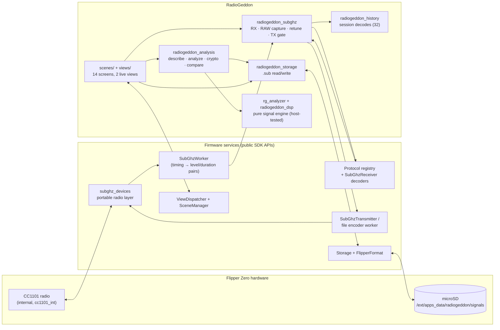
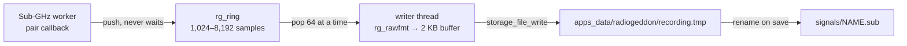

# Architecture

RadioGeddon is a single Flipper Zero external application (`.fap`) written in
C. Everything — reception, decoding, storage and analysis — runs on the
device's STM32WB55 and CC1101 radio; nothing is sent to a phone or computer.

This page explains how the pieces fit together. For what each screen does, see
the [User Guide](USER_GUIDE.md); for the analysis logic, see
[Protocol Analysis](PROTOCOL_ANALYSIS.md).

## Overview



## Source layout

```
radiogeddon.c / .h          App context: allocates services, views and scenes; 100 ms UI tick
radiogeddon_version.h       Release version string (checked against the release tag)
application.fam             Flipper app manifest (appid, category, icon, sources)
scenes/                     One file per screen; the scene list is generated from
                            radiogeddon_scene_config.h (X-macros)
views/                      Custom canvas views: scanner sweep, live receiver, pulse timeline,
                            database list
helpers/
  radiogeddon_subghz.*      Radio wrapper: device, decoders, RAW capture, hopper retune, TX
  radiogeddon_recorder.*    Streaming RAW recorder: lock-free ring + SD writer thread
  radiogeddon_storage.*     SD-card layout, .sub parsing, streaming RAW file access
  radiogeddon_scanner.*     Scanner sweep thread, results and CSV export
  radiogeddon_hopper.*      Hopper thread, auto-recording, statistics report
  radiogeddon_settings.*    Settings persisted to the SD card
  radiogeddon_db.*          Database index: lists the signals folder, reads file heads
  radiogeddon_report.*      Writes a file's analysis reports to reports/<name>.txt
  radiogeddon_memdiag.*     Heap sampling and the About memory figures
  radiogeddon_history.*     Per-session list of decoded signals (max 32, de-duplicated)
  radiogeddon_analysis.*    Text reports: info, analysis, crypto, compare, unknown-protocol
  radiogeddon_dsp.*         Pure RAW parsing / clustering helpers (no firmware headers)
  rg_analyzer.*             Pure streaming signal-analysis engine (no firmware headers)
  rg_raw.*                  Pure streaming RAW_Data reader with seek checkpoints
  rg_rawfmt.*               Pure RAW .sub writer: header, RAW_Data lines, lost-sample note
  rg_ring.*                 Pure lock-free single-producer/single-consumer sample ring
  rg_timeline.*             Pure pulse-timeline maths: columns, labels, pan, zoom, frames
  rg_scan.*                 Pure scanner logic: noise floor, detection, peak hold
  rg_hop.*                  Pure hopper state machine: dwell, hold, lock, history
  rg_db.*                   Pure database index: .sub header parsing, duplicates, query
  rg_memstat.*              Pure memory bookkeeping: lowest/peak, session cost, fit check
assets/                     10x10 launcher icon (compiled into the .fap)
test/                       Host unit tests (519 checks) + reference .sub fixtures
scripts/                    Pinned builds, manifest verification, packaging, link check
tools/brand/                Generator for the logo, banner and social preview
.github/workflows/          CI (ci.yml), shared build pipeline (build.yml), release.yml
```

## Screens and navigation

The app uses the firmware's standard GUI framework: a `ViewDispatcher` owns
the views and a `SceneManager` drives navigation. Each scene has
`on_enter` / `on_event` / `on_exit` handlers; the 100 ms tick event drives the
live displays (RSSI, scanner sweep, hopper timing, recording counters).

Reusable firmware widgets (`Submenu`, `Widget`, `VariableItemList`, `Popup`,
`TextInput`, `TextBox`) cover menus and reports. Long SD-card work runs in a
scene's `on_enter` behind a `Popup`; operations that can measure their
progress (Database indexing, whole-file analysis) call a
`RadioGeddonProgressCallback`, and `radiogeddon_scene_progress` writes the
percentage under the popup at most every 150 ms. The GUI thread redraws it
while the app thread keeps working. Errors that end an action are shown by a
small Message scene that closes itself after three seconds. Two custom views draw the live
screens: the **scanner** (per-frequency RSSI bars) and the **receiver** (RSSI
meter, recording status, decoded-signal list), which the Frequency Hopper also
reuses.

## Radio layer

All radio access goes through `helpers/radiogeddon_subghz.c`, which uses only
the portable `subghz_devices_*` API — the same layer the stock Sub-GHz app
uses — so RadioGeddon builds unchanged for Official, Unleashed and RogueMaster.

**Radio selection.** `radiogeddon_subghz_set_radio()` picks `cc1101_int` or
the firmware's `cc1101_ext` plugin, and only while nothing is receiving or
transmitting. External is used only if `subghz_devices_is_connect()` on it
succeeds; that call probes the chip over SPI without keeping it initialised.
As in the stock app, the 5 V pin (OTG) is switched on for the module when the
`Ext radio 5V` setting allows it and it wasn't already on. RadioGeddon
switches it off again only if it switched it on. Before a transmission
through the external module the module is probed again and the frequency is
checked against the firmware's region table (`furi_hal_region_is_frequency_allowed`),
in addition to the driver's own check in `subghz_devices_set_tx()`.

**Receive.** The CC1101 is configured with a standard preset (AM270, AM650,
FM238 or FM476) and frequency, then put into asynchronous capture. The
firmware's `SubGhzWorker` turns the captured timings into (level, duration)
pairs on a worker thread. RadioGeddon feeds every pair to two consumers:

1. A `SubGhzReceiver` holding all of the firmware's *decodable* protocol
   decoders. When one matches, the parcel is serialized to a complete,
   loadable `.sub` text in RAM and stored in the session history.
2. When RAW recording is on, the streaming recorder: each signed duration
   (positive = carrier on, negative = off) goes into a lock-free ring, and a
   writer thread streams the ring to a RAW `.sub` file on the SD card (see
   *Streaming RAW recording* below).

**Memory lifecycle.** Nothing radio-related beyond the device handle is
allocated at app start. The protocol environment, manufacturer keystore,
receiver (one decoder per registered protocol) and worker are created in
`rx_start` and freed in `rx_stop`; a protocol replay creates an environment
without the keystore for the duration of the transmission. The recorder is
allocated in `record_start`, with its ring sized from
`memmgr_heap_get_max_free_block()` (largest power of two from 1,024 to 8,192
samples that leaves 12 KB free beyond it, the 2 KB write buffer and the
writer's stack; refused below 1,024), and freed when recording stops.
Allocating the radio state at launch exceeded the free heap on RogueMaster and
crashed the app before the main menu (fixed in `1.0.0-beta.2`).

**Receive-session memory check.** `rx_start` reads the free heap and the
firmware's low-water mark (`memmgr_get_minimum_free_heap()`) before
allocating and again once the worker runs; the session's cost is the drop in
free heap, or the drop to the new low-water mark if setup pushed it lower
(`rg_mem_session_cost`). Receive and Hopper keep that figure in the settings
file (`Radio_heap`) with a tag of the firmware it was measured on
(`Radio_heap_fw`, from the firmware version and git hash), replacing it after a
session when it changed by more than 1 KB. Before the next start,
`radiogeddon_scene_radio_memory_ok()` refuses with `Not enough memory` when
less than that cost plus 6 KB is free. With no measurement for the running
firmware nothing is refused, so behaviour is unchanged until a session has run.

**Memory diagnostics.** `helpers/radiogeddon_memdiag.c` keeps the free heap at
app start and the lowest free heap seen (`rg_memstat`), sampled on every 100 ms
tick, after the radio, recorder, Scanner and timeline allocations, and on
every progress report of long SD-card work; each named sample labels the ones
after it. Only the app thread samples, so it needs no lock, and a sample is one
read of a firmware counter. About shows these figures with the largest free
block and the low-water mark since boot, and the app logs a summary on exit.

### Streaming RAW recording



- **The radio thread never touches the filesystem.** The pair callback runs on
  the Sub-GHz worker thread, alongside the protocol decoders. It only appends
  to `rg_ring`, a single-producer/single-consumer ring with acquire/release
  indices; a push into a full ring is refused at once and counted.
- **Losses are measured, not hidden.** Refused samples are counted, together
  with the number of gaps (runs of refusals) and where the first one was.
  They are shown live, written as a final `# Lost: …` comment (FlipperFormat
  ignores comments; the firmware's file encoder stops at the first non-RAW line,
  which is the end anyway), and read back by `rg_raw` into the analysis report.
  The samples around a gap are kept as they are, so timing jumps there; no
  filler is invented.
- **Writer.** Pops 64 samples at a time, formats them without `snprintf`
  (`rg_rawfmt`), and writes 2 KB at a time; when idle it writes whatever is
  buffered every 250 ms. It polls every 20 ms and is woken at once on stop.
- **Start and stop.** The ring is attached to the worker before the file is
  created, so the start of a transmission is not lost to file-open latency.
  To stop, the recorder pointer is cleared and the stopping thread waits until
  the worker is out of its push (a two-flag handshake with sequentially
  consistent atomics), then the writer drains the ring, the last line and the
  loss note are written, and the file is closed.
- **Saving.** The capture lives in `recording.tmp` until it is saved: Save
  renames it to a name that does not exist yet; Back, a failed save, an empty
  capture or a write error deletes it. A `recording.tmp` left by a reboot
  during recording is deleted when the app starts. Saving a decode while
  recording stops and names the recording first, because leaving the receiver
  stops the radio session the recorder is attached to.
- Ring, formatter and loss accounting are host-tested, the ring with a real
  producer thread, and the recorder end to end against stub Furi/Storage
  layers that can make the "card" slow or fail (see
  [Verification](VERIFICATION.md)).

The start/stop order mirrors the firmware's own Sub-GHz subsystem
(`start_async_rx` → start worker; stop worker → `stop_async_rx` → idle →
sleep), and frequencies are validated before tuning because the HAL asserts on
out-of-band values.

**Scanner.** A worker thread (`helpers/radiogeddon_scanner.c`, 1.5 KB stack)
owns the radio while the Scanner screen is open. It keeps a light session
powered and, for each frequency in the scan list, retunes, waits 3 ms for the
AGC and then samples RSSI every millisecond for the dwell time, keeping the
strongest reading. That reading goes into the pure `rg_scan` logic: a noise
floor that falls quickly and rises slowly on quiet readings (frozen while
active), threshold detection with 3 dB hysteresis, a peak hold and a burst
counter. The GUI thread copies a snapshot under a mutex on every 100 ms tick,
and the thread posts a custom event for each new burst. The results object is
allocated on first use and freed when the user returns to the main menu; the
thread exists only while the Scanner screen is open, and stopping it ends the
radio session before the receiver can start.

**Settings.** `helpers/radiogeddon_settings.c` stores frequency, modulation and
the scan options in a small Flipper Format file. Every field is validated on
load and falls back to its default independently. A save writes
`settings.tmp` and renames it over `settings.txt` only when every field was
written, so a card error keeps the previous file.

**Frequency Hopper.** The scene starts the receive session, then a hopper
thread (`helpers/radiogeddon_hopper.c`, 3 KB stack) drives it: every 10 ms it
reads RSSI and feeds the pure `rg_hop` state machine, which keeps a `rg_scan`
noise floor per frequency, holds on floor-relative activity or on a decode
(reported from the worker thread), extends the hold while activity continues,
and asks for a retune when a quiet frequency's dwell is over. Retunes use the
live session without powering the radio down (stop worker and capture → set
frequency → restart). With auto-record on, the thread starts a RAW capture
when activity starts and stops and saves it when the hold ends or before any
retune. On exit the scene stops the thread (saving any capture in progress)
before stopping RX. Statistics and the activity ring buffer outlive the thread
and are freed at the main menu. The scene logs free heap on entry and exit
(`RadioGeddonHopperScene`) as a simple leak check.

**Transmit.** Replay opens the saved `.sub`, refuses files it should not send
(see [Features → Replay](FEATURES.md#authorized-signal-replay)), loads the
file's own modulation, and asks the firmware for permission to transmit
(`subghz_devices_set_tx`, which applies the device's regional rules) before
starting. RAW files are streamed by the firmware's file encoder worker;
decoded static protocols are re-encoded by the matching firmware encoder.

### Threads

| Thread | Runs | Rule |
|--------|------|------|
| GUI / event loop | scenes, views, ticks, file I/O, analysis | the only thread that touches views |
| Sub-GHz worker | pair callback → decoders, recorder ring | records into mutex-protected history, then posts a custom event; never touches the filesystem |
| RAW writer | drains the recorder ring to the SD card | runs only while recording; never touches views |
| Scanner | RSSI sweep | results under a mutex; the scene reads them on the tick |
| Hopper | RSSI sampling, retuning, auto-recording | state under a mutex; events posted to the scene |
| File encoder worker | RAW replay streaming | signals completion with a custom event |

Memory diagnostics are sampled only on the GUI / event-loop thread (ticks,
scenes and the work they run); the hopper's automatic recordings show up in
the next tick's sample.

## Storage

Recordings are standard Flipper `.sub` files in
`/ext/apps_data/radiogeddon/signals` (created on first launch), so they stay
interoperable with the stock Sub-GHz app and other tools:

- decoded signals use `Filetype: Flipper SubGhz Key File`;
- RAW captures use `Filetype: Flipper SubGhz RAW File` with `RAW_Data` lines
  of up to 512 values, plus a final `# Lost: …` comment only if samples were
  dropped while recording.

### Signal Database

`radiogeddon_db` builds an index when the Database opens, in passes that keep
at most one file open:

1. Count the `.sub` files and the bytes their names need.
2. Size the index from that count, capped at 500 files and by the free heap
   (24 KB is always left for the screens opened from the list). If not all
   fit, the first ones are indexed and the list says `N of M`.
3. List the folder again, storing each name in one shared pool and its size.
4. With the folder closed, read each file's first 512 bytes; `rg_db` parses
   `Filetype`, `Frequency`, `Protocol`, `Bit` and `Key` (hashed with FNV-1a)
   and classifies the file as decoded, RAW, another `.sub` kind or damaged.
5. Read whole RAW files only where two have the same size, to hash their
   contents; then mark duplicates.

Sorting, filtering and searching (`rg_db_select`) produce a list of entry
numbers without touching the card. The list view (`radiogeddon_db_view`)
draws from the index; the query is changed only between
`radiogeddon_db_view_lock` and `_unlock`, so the view never draws while it
changes. The index and view are freed on returning to the main menu, and
rebuilt after a rename, a delete or `Reload from SD`, keeping the highlighted
file by name.

Files the index marks damaged, or that `radiogeddon_storage_load` cannot
parse, open with only File details, Rename and Delete. Rename checks the new
name with `rg_db_check_name` and refuses an existing file before calling
`storage_common_rename`, which would otherwise replace it. Reports are written
section by section through one reused string, to a new file opened with
`FSOM_CREATE_NEW`; a partly written report is removed.

## Analysis pipeline

`radiogeddon_analysis.c` builds every text report from the parsed file in
`radiogeddon_storage`:

- `radiogeddon_dsp` — pulse-width clustering used by the basic Signal Analyzer;
- `rg_raw` — reads `RAW_Data` values through a 256-byte buffer, never a whole
  line or file, and keeps up to 32 checkpoints (byte offset, sample index,
  time) so a reader can seek to a time without re-reading from the start.
  `radiogeddon_storage_raw_open` wraps it around a Storage file stream;
- `rg_analyzer` — the engine behind Unknown Protocol Analysis and RAW
  comparison. It streams: the caller feeds the whole file once per pass
  (timing histograms, then trial decoding, then frame grouping), so its state
  is a fixed ~8 KB (`RgAnalyzer`) whatever the file length. The app allocates
  it only while a report is built, after checking the largest free heap block
  leaves a margin, and frees it before showing the report.

The **Pulse Timeline** reuses both. On entry it opens the file, runs the
analyzer once for frame starts and Te (which also fills the reader's seek
checkpoints), frees the analyzer, and only then allocates its view
(`views/radiogeddon_timeline_view`, a ~4.5 KB model holding a 1,024-sample
window). The view and the open file exist only while that screen is shown;
the view is added to the ViewDispatcher on entry and removed on exit. When
panning or zooming leaves the window, the view posts a reload event and the
scene seeks to the nearest checkpoint and streams a new window. The layout
maths lives in the pure `rg_timeline` module.

These are plain C with no firmware headers, so `test/` compiles and runs
them on a normal computer under AddressSanitizer and UndefinedBehaviorSanitizer.
See [Protocol Analysis](PROTOCOL_ANALYSIS.md) for the algorithms and how
results are labelled.

## Build and release

- `scripts/firmware_pins.sh` pins the exact SDK for each firmware family
  (Official 1.4.3, Unleashed unlshd-093, RogueMaster commit `38d7ae9`).
- `scripts/build_target.sh` downloads and checksums the SDK, asserts its API
  version, builds the `.fap`, and verifies its manifest with
  `scripts/verify_fap.py`.
- `.github/workflows/build.yml` runs that for all three firmware families plus
  host tests, link checks and lint, for every pull request (`ci.yml`) and every
  release tag (`release.yml`).
- Releases are created only from tags, after all builds pass; assets are
  staged in a draft, re-downloaded and checksum-verified before publishing, and
  each `.fap` gets a signed build-provenance attestation.

## Design principles

- **Standalone.** No companion app, network, or desktop processing is required.
- **Real data only.** Analysis runs on actual captures; there is no simulated
  reception or placeholder output.
- **Honest labelling.** Firmware decoder matches are `[CONFIRMED]`; direct
  measurements are `[OBSERVED]`; statistics are `[HEURISTIC]`; engine
  inferences are `[HYPOTHESIS]`.
- **Firmware safety rails stay on.** Regional transmit rules are enforced by
  the firmware, dynamic/rolling-code protocols are never replayed, and builds
  are never re-labelled to load on a firmware they weren't compiled for.
- **Interoperable files.** Everything is stored as standard `.sub`, which keeps
  the door open for a future desktop companion (not part of this project).
