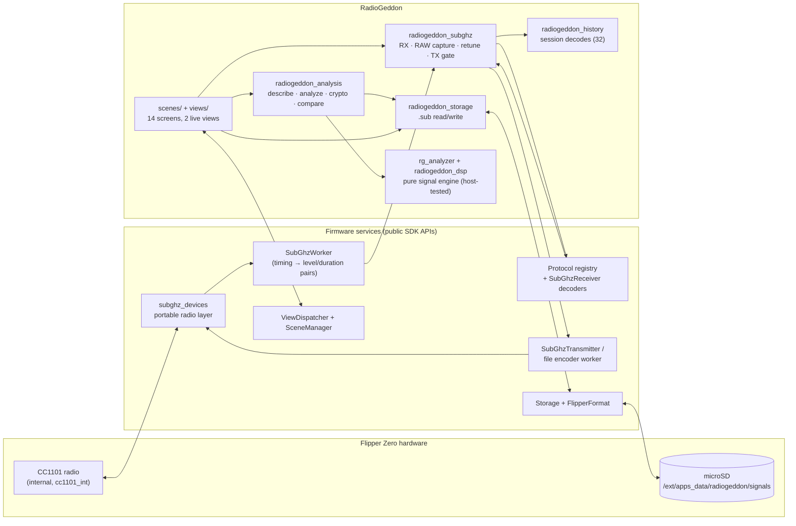

# Architecture

RadioGeddon is a single Flipper Zero external application (`.fap`) written in
C. Everything — reception, decoding, storage and analysis — runs on the
device's STM32WB55 and CC1101 radio; nothing is sent to a phone or computer.

This page explains how the pieces fit together. For what each screen does, see
the [User Guide](USER_GUIDE.md); for the analysis logic, see
[Protocol Analysis](PROTOCOL_ANALYSIS.md).

## Overview



## Source layout

```
radiogeddon.c / .h          App context: allocates services, views and scenes; 100 ms UI tick
radiogeddon_version.h       Release version string (checked against the release tag)
application.fam             Flipper app manifest (appid, category, icon, sources)
scenes/                     One file per screen; the scene list is generated from
                            radiogeddon_scene_config.h (X-macros)
views/                      Custom canvas views: scanner sweep, live receiver
helpers/
  radiogeddon_subghz.*      Radio wrapper: device, decoders, RAW capture, hopper retune, TX
  radiogeddon_storage.*     SD-card layout, .sub parsing, streaming RAW file access
  radiogeddon_scanner.*     Scanner sweep thread, results and CSV export
  radiogeddon_hopper.*      Hopper thread, auto-recording, statistics report
  radiogeddon_settings.*    Settings persisted to the SD card
  radiogeddon_history.*     Per-session list of decoded signals (max 32, de-duplicated)
  radiogeddon_analysis.*    Text reports: info, analysis, crypto, compare, unknown-protocol
  radiogeddon_dsp.*         Pure RAW parsing / clustering helpers (no firmware headers)
  rg_analyzer.*             Pure streaming signal-analysis engine (no firmware headers)
  rg_raw.*                  Pure streaming RAW_Data reader with seek checkpoints
  rg_scan.*                 Pure scanner logic: noise floor, detection, peak hold
  rg_hop.*                  Pure hopper state machine: dwell, hold, lock, history
assets/                     10x10 launcher icon (compiled into the .fap)
test/                       Host unit tests (222 checks) + reference .sub fixtures
scripts/                    Pinned builds, manifest verification, packaging, link check
tools/brand/                Generator for the logo, banner and social preview
.github/workflows/          CI (ci.yml), shared build pipeline (build.yml), release.yml
```

## Screens and navigation

The app uses the firmware's standard GUI framework: a `ViewDispatcher` owns
the views and a `SceneManager` drives navigation. Each scene has
`on_enter` / `on_event` / `on_exit` handlers; the 100 ms tick event drives the
live displays (RSSI, scanner sweep, hopper timing, recording counters).

Reusable firmware widgets (`Submenu`, `Widget`, `VariableItemList`, `Popup`,
`TextInput`, `TextBox`) cover menus and reports. Two custom views draw the live
screens: the **scanner** (per-frequency RSSI bars) and the **receiver** (RSSI
meter, recording status, decoded-signal list), which the Frequency Hopper also
reuses.

## Radio layer

All radio access goes through `helpers/radiogeddon_subghz.c`, which uses only
the portable `subghz_devices_*` API — the same layer the stock Sub-GHz app
uses — so RadioGeddon builds unchanged for Official, Unleashed and RogueMaster.

**Receive.** The CC1101 is configured with a standard preset (AM270, AM650,
FM238 or FM476) and frequency, then put into asynchronous capture. The
firmware's `SubGhzWorker` turns the captured timings into (level, duration)
pairs on a worker thread. RadioGeddon feeds every pair to two consumers:

1. A `SubGhzReceiver` holding all of the firmware's *decodable* protocol
   decoders. When one matches, the parcel is serialized to a complete,
   loadable `.sub` text in RAM and stored in the session history.
2. When RAW recording is on, an in-RAM buffer of up to **16,384** signed
   durations (positive = carrier on, negative = off), written to a standard
   RAW `.sub` file when you save.

**Memory lifecycle.** Nothing radio-related beyond the device handle is
allocated at app start. The protocol environment, manufacturer keystore,
receiver (one decoder per registered protocol) and worker are created in
`rx_start` and freed in `rx_stop`; a protocol replay creates an environment
without the keystore for the duration of the transmission. The RAW buffer is
allocated in `record_start`, sized from `memmgr_heap_get_max_free_block()`
minus a 12 KB reserve (capped at 16,384 samples, refused below 1,024), and
freed after a successful save. Allocating all of this at launch exceeded the
free heap on RogueMaster and crashed the app before the main menu (fixed in
`1.0.0-beta.2`).

The start/stop order mirrors the firmware's own Sub-GHz subsystem
(`start_async_rx` → start worker; stop worker → `stop_async_rx` → idle →
sleep), and frequencies are validated before tuning because the HAL asserts on
out-of-band values.

**Scanner.** A worker thread (`helpers/radiogeddon_scanner.c`, 1.5 KB stack)
owns the radio while the Scanner screen is open. It keeps a light session
powered and, for each frequency in the scan list, retunes, waits 3 ms for the
AGC and then samples RSSI every millisecond for the dwell time, keeping the
strongest reading. That reading goes into the pure `rg_scan` logic: a noise
floor that falls quickly and rises slowly on quiet readings (frozen while
active), threshold detection with 3 dB hysteresis, a peak hold and a burst
counter. The GUI thread copies a snapshot under a mutex on every 100 ms tick,
and the thread posts a custom event for each new burst. The results object is
allocated on first use and freed when the user returns to the main menu; the
thread exists only while the Scanner screen is open, and stopping it ends the
radio session before the receiver can start.

**Settings.** `helpers/radiogeddon_settings.c` stores frequency, modulation and
the scan options in a small Flipper Format file. Every field is validated on
load and falls back to its default independently.

**Frequency Hopper.** The scene starts the receive session, then a hopper
thread (`helpers/radiogeddon_hopper.c`, 3 KB stack) drives it: every 10 ms it
reads RSSI and feeds the pure `rg_hop` state machine, which keeps a `rg_scan`
noise floor per frequency, holds on floor-relative activity or on a decode
(reported from the worker thread), extends the hold while activity continues,
and asks for a retune when a quiet frequency's dwell is over. Retunes use the
live session without powering the radio down (stop worker and capture → set
frequency → restart). With auto-record on, the thread starts a RAW capture
when activity starts and stops and saves it when the hold ends or before any
retune. On exit the scene stops the thread (saving any capture in progress)
before stopping RX. Statistics and the activity ring buffer outlive the thread
and are freed at the main menu. The scene logs free heap on entry and exit
(`RadioGeddonHopperScene`) as a simple leak check.

**Transmit.** Replay opens the saved `.sub`, refuses files it should not send
(see [Features → Replay](FEATURES.md#authorized-signal-replay)), loads the
file's own modulation, and asks the firmware for permission to transmit
(`subghz_devices_set_tx`, which applies the device's regional rules) before
starting. RAW files are streamed by the firmware's file encoder worker;
decoded static protocols are re-encoded by the matching firmware encoder.

### Threads

| Thread | Runs | Rule |
|--------|------|------|
| GUI / event loop | scenes, views, ticks, file I/O, analysis | the only thread that touches views |
| Sub-GHz worker | pair callback → decoders, RAW buffer | records into mutex-protected history, then posts a custom event |
| File encoder worker | RAW replay streaming | signals completion with a custom event |

## Storage

Recordings are standard Flipper `.sub` files in
`/ext/apps_data/radiogeddon/signals` (created on first launch), so they stay
interoperable with the stock Sub-GHz app and other tools:

- decoded signals use `Filetype: Flipper SubGhz Key File`;
- RAW captures use `Filetype: Flipper SubGhz RAW File` with `RAW_Data` lines
  of up to 512 values.

The database screen uses the firmware's file browser filtered to `.sub`.

## Analysis pipeline

`radiogeddon_analysis.c` builds every text report from the parsed file in
`radiogeddon_storage`:

- `radiogeddon_dsp` — pulse-width clustering used by the basic Signal Analyzer;
- `rg_raw` — reads `RAW_Data` values through a 256-byte buffer, never a whole
  line or file, and keeps up to 32 checkpoints (byte offset, sample index,
  time) so a reader can seek to a time without re-reading from the start.
  `radiogeddon_storage_raw_open` wraps it around a Storage file stream;
- `rg_analyzer` — the engine behind Unknown Protocol Analysis and RAW
  comparison. It streams: the caller feeds the whole file once per pass
  (timing histograms, then trial decoding, then frame grouping), so its state
  is a fixed ~8 KB (`RgAnalyzer`) whatever the file length. The app allocates
  it only while a report is built, after checking the largest free heap block
  leaves a margin, and frees it before showing the report.

These are plain C with no firmware headers, so `test/` compiles and runs
them on a normal computer under AddressSanitizer and UndefinedBehaviorSanitizer.
See [Protocol Analysis](PROTOCOL_ANALYSIS.md) for the algorithms and how
results are labelled.

## Build and release

- `scripts/firmware_pins.sh` pins the exact SDK for each firmware family
  (Official 1.4.3, Unleashed unlshd-093, RogueMaster commit `38d7ae9`).
- `scripts/build_target.sh` downloads and checksums the SDK, asserts its API
  version, builds the `.fap`, and verifies its manifest with
  `scripts/verify_fap.py`.
- `.github/workflows/build.yml` runs that for all three firmware families plus
  host tests, link checks and lint, for every pull request (`ci.yml`) and every
  release tag (`release.yml`).
- Releases are created only from tags, after all builds pass; assets are
  staged in a draft, re-downloaded and checksum-verified before publishing, and
  each `.fap` gets a signed build-provenance attestation.

## Design principles

- **Standalone.** No companion app, network, or desktop processing is required.
- **Real data only.** Analysis runs on actual captures; there is no simulated
  reception or placeholder output.
- **Honest labelling.** Firmware decoder matches are `[CONFIRMED]`; direct
  measurements are `[OBSERVED]`; statistics are `[HEURISTIC]`; engine
  inferences are `[HYPOTHESIS]`.
- **Firmware safety rails stay on.** Regional transmit rules are enforced by
  the firmware, dynamic/rolling-code protocols are never replayed, and builds
  are never re-labelled to load on a firmware they weren't compiled for.
- **Interoperable files.** Everything is stored as standard `.sub`, which keeps
  the door open for a future desktop companion (not part of this project).
